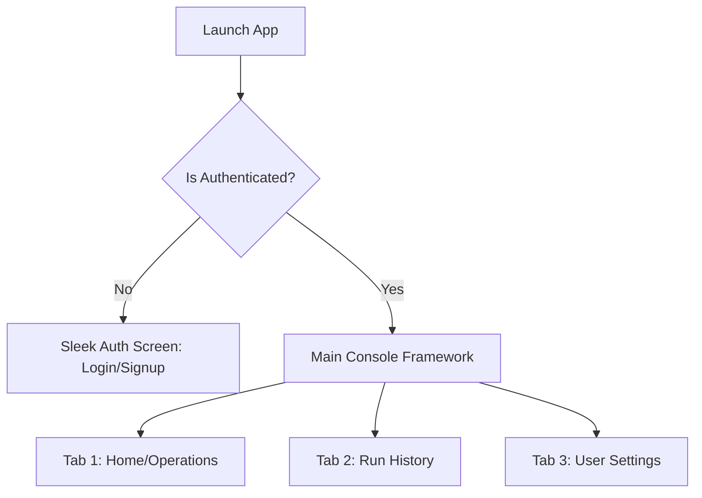
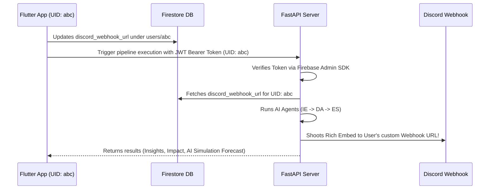

# 🚀 Antigravity Mobile App Architecture & Design Plan

This plan outlines the visual design system, screen architecture, and Firebase multi-user synchronization strategy for the **Antigravity Mobile Operations Console**. 

---

## 🎨 1. Premium Visual Design System
To make a premium, state-of-the-art interface that will WOW the hackathon judges, we will move away from standard material designs and adopt a **Sleek Glassmorphic Dark-SaaS Theme** inspired by world-class developer tools like **Supabase, Stripe, and Linear**.

### Palette Definition (HSL-Curated Dark)
| Token | Hex Value | Role |
| :--- | :--- | :--- |
| **Scaffold Background** | `#080C14` | Deepest Obsidian |
| **Card / Container Background** | `#111827` (with `#1F2937` border) | Slate Dark with subtle glass borders |
| **Primary Accent** | `#6366F1` to `#8B5CF6` | Radiant Neon Indigo-to-Violet Gradient |
| **Success State** | `#10B981` | Emerald Green (Operations Online) |
| **Warning State** | `#F59E0B` | Amber Yellow (Medium Severity) |
| **Danger State** | `#EF4444` | Crimson Rose (Critical Alert) |

### Typography & Aesthetics
* **Font:** Inter or Plus Jakarta Sans (loaded dynamically from Google Fonts).
* **Glassmorphism:** Cards will use `1px` translucent borders (`Color(0xFF334155).withOpacity(0.4)`) to stand out from the black scaffold background.
* **Micro-Animations:** Fluid screen transitions, fade-in loading indicators, and tactile bounce effects on buttons.

---

## 📱 2. Screen & Navigation Architecture
The application will utilize a **Bottom Navigation Bar** (Downbar) with three core tabs, guarded by a modern Auth gateway.



### 🔒 Gateway: Sleek Auth Screen (Login / Sign Up)
* **Visuals:** Minimalist obsidian login panel with an glowing gradient background card, showcasing the Antigravity rocket logo.
* **Functionality:** Tab toggle between **Sign In** and **Sign Up**. Under the hood, this authenticates directly with **Firebase Auth**.
* **Profile Setup:** During first-time sign-up, the user enters their name, which creates a profile document in Firestore.

### 🏠 Tab 1: Home (Core Agentic Operations)
* **The Ingestion Engine:**
  * Clean text-area for pasting reports or URLs.
  * Drag-and-drop / select interface to **Upload Business PDFs** directly from the mobile file picker.
* **The Simulation Card:**
  * When a report is submitted, a sleek pulsing orbital scanner shows the active agent steps (IE ➔ DA ➔ ES).
  * After completion, it dynamically loads:
    * **🧠 Insight & 💥 Impact:** Color-coded based on AI strategic risk severity.
    * **🤔 Decision & 🎯 Action Executed:** Displaying the exact custom action title (max 5 words).
    * **🔮 AI Simulation Forecast:** A gorgeous projected outcomes table (e.g. *Expected Resolution: 24h*, *Savings: $500k*).

### 📜 Tab 2: History (Audit Log)
* **List View:** A beautiful vertical feed of all previous agent execution sessions (Audit Logs) saved in the user's database.
* **Interactive Expandable Tiles:** Tapping a session smoothly expands it to show the full original input report, the AI reasoning trace, and the exact state differences (simulation outcomes).

### ⚙️ Tab 3: Profile & Settings (Multi-User Configuration)
* **User Card:** Displays the logged-in user's profile picture, name, and registered email address.
* **Multi-User Discord Binding:** 
  * A text input field labeled **"Discord Webhook URL"**.
  * A **"Save Profile"** button that writes this URL directly to their Firebase Firestore user document.
* **Log Out Button:** Gracefully signs out from Firebase and returns to the Auth gateway.

---

## 🔄 3. Multi-User Firebase & FastAPI Synchronization Architecture
To achieve true multi-user support across both Web and Mobile, we will bind the AI pipeline's webhook delivery directly to the logged-in user's credentials.



### Technical implementation steps for this sync:
1. **Firebase Firestore Collection (`users`):**
   Each user document is keyed by their unique Firebase UID:
   ```json
   users/{uid} {
     "displayName": "User Name",
     "email": "user@email.com",
     "discord_webhook_url": "https://discord.com/api/webhooks/..."
   }
   ```
2. **FastAPI Bearer Authentication:**
   We will add a secure endpoint check in FastAPI. When the mobile or web app invokes `/api/v1/test/analyze`, they send the **Firebase ID Token** in the `Authorization: Bearer <TOKEN>` header.
3. **Admin Token Verification:**
   The backend uses the `firebase-admin` python library to decode the token:
   ```python
   decoded_token = auth.verify_id_token(token)
   uid = decoded_token['uid']
   ```
4. **Dynamic Webhook Lookup:**
   Instead of pulling `DISCORD_WEBHOOK_URL` from the server's static `.env` file, the backend queries Firestore for `users/{uid}/discord_webhook_url` dynamically! 
   * If the user has a custom webhook configured in their profile, their Discord gets the alerts.
   * If not, it falls back to the server's default fallback webhook.
