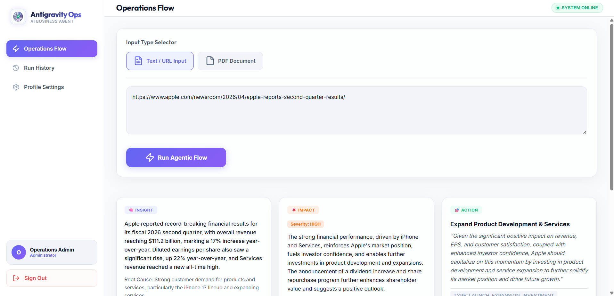

# Nexus Ops: Autonomous Business Operations Agent

Nexus Ops is a state-of-the-art, cloud-backed autonomous business operations platform. It orchestrates a multi-agent AI pipeline to ingest business reports (via text, URLs, or raw PDFs), detect revenue/operational anomalies, dynamically formulate optimal mitigation strategies, simulate live executions inside a sandbox database, and push real-time telemetry updates to a premium Flutter-based mobile dashboard and a high-end web console.

---

## 🎨 Visual Preview & Branding

Here is a preview mockup showing the clean layouts and premium off-white design structure of the Nexus Ops web dashboard:



---

## System Architecture

The ecosystem consists of three core decoupled systems:
1. **Backend (`/backend`)**: A robust FastAPI application executing the native multi-agent pipeline using the `google-genai` SDK, backed by a local SQLite Sandbox Database and fully deployed to Google Cloud Run.
2. **Mobile App (`/Mobile App`)**: A premium, highly animated Flutter application linked to Firebase for real-time history streams, authentication, and secure profile management.
3. **Web Portal (`/web`)**: A high-end, visual Single-Page Web Application designed using an off-white glassmorphism layout, featuring drag-and-drop ingestion, interactive stepper logs, real-time Firestore synchronization, and profile webhook configurations.

---

## The Agentic Pipeline Flow

The AI pipeline is engineered for speed, cost-efficiency, and total predictability:
1. **Ingress Preprocessing**: Accepts raw text, scraped web URLs, or multi-page PDFs (processed natively using the Gemini File API).
2. **IE-Agent (Insight Extraction) & IA-Agent (Impact Analysis)**: A merged single-call agent that identifies business anomalies and analyzes their severity.
3. **DA-Agent (Decision Action)**: Maps anomalies to a structured Action Plan (e.g., launching promotions, lowering delivery fees, or generating tickets).
4. **ES-Agent (Execution Simulation)**: A deterministic worker that writes live state changes to the SQLite database, triggers Discord alerts (dynamic user or global default), and logs complete traces.

---

## Web Portal Setup & Execution (`/web`)

The Web Portal is structured as a premium, responsive Single-Page Application (SPA) leveraging standard **ES Modules (ESM)**. It requires zero compilation or complex local build tools.

### Key Features:
* **Off-White Glassmorphism UI**: Harmoniously synced with the Mobile App's theme palette, featuring outfit + Inter typography, soft borders, and fluid CSS micro-animations.
* **Dual Ingestion Engine**: Drag-and-drop PDF upload zone with native Gemini File API piping, plus a text/URL analysis controller.
* **Collapsible Run History**: Interactive timeline panel that streams user runs in real-time from Firestore.
* **Intelligent URL Formatting Boxes**: Parses extracted URLs and wraps them in a stylized container, complete with copy-on-hover triggers, Lucide external link vector icons, responsive ellipsis clipping, and click propagation filters.
* **Authentication Session Controller**: Fully integrated with Firebase Auth for secure login and persistence.

### Local Server Launch:
1. Double-click [index.html](file:///c:/Users/wajee/OneDrive/Desktop/ai-seekho-hackathon/web/index.html) in any standard web browser, OR
2. Run a static local server via npm:
   ```bash
   cd web
   npx -y serve -p 3000
   ```
   Open **[http://localhost:3000](http://localhost:3000)** in your browser.

### Docker Configuration:
The `/web` folder includes a deployment-ready `Dockerfile` running a high-performance alpine-based Nginx container to serve the static assets in cloud environments.

---

## Backend Setup & Execution (`/backend`)

The backend is built in **Python 3.10+**. Follow these precise steps to get it running:

### 1. Create and Activate Virtual Environment
Open your terminal and navigate to the backend directory:
```bash
cd backend
```
Create a localized virtual environment:
```bash
python -m venv venv
```
Activate the environment:
* **Windows (PowerShell)**:
  ```powershell
  .\venv\Scripts\activate
  ```
* **Mac/Linux**:
  ```bash
  source venv/bin/activate
  ```

### 2. Install Dependencies
Ensure you are using the active virtual environment (you will see `(venv)` in your terminal prompt) and run:
```bash
pip install -r requirements.txt
```

### 3. Environment Variables Configuration
Copy the sample environment file to create your active `.env`:
```bash
cp .env.example .env
```
Open the `.env` file and configure your keys:
* **LLM_PROVIDER**: Set to `gemini` to use your native Google Key, or `openrouter` to use the OpenRouter proxy.
* **GEMINI_API_KEY**: **Must be a valid key starting with `AIzaSy...`** obtained from [Google AI Studio](https://aistudio.google.com/).
* **OPENROUTER_API_KEY**: Your `sk-or-v1-...` key if using OpenRouter.
* **MOCK_DISCORD_WEBHOOK_URL**: Your active Discord channel webhook to receive live alert simulation broadcasts.
* **FIREBASE_CREDENTIALS_PATH**: Absolute or relative path to `firebase-service-account.json` (defaults to root).

### 4. Run the Backend Server
```bash
uvicorn main:app --reload
```
The Developer Console will boot up at **[http://127.0.0.1:8000](http://127.0.0.1:8000)**.

### 5. Production Deployment to Google Cloud Run
The backend includes a production-ready `Dockerfile` and is fully configured to run on Google Cloud Run:

```bash
# Navigate to the backend directory
cd backend

# Deploy directly from source to Cloud Run
gcloud run deploy ai-seekho-backend \
  --source . \
  --project long-ceiling-496821-m7 \
  --region us-central1 \
  --allow-unauthenticated
```

* **Live Backend Base URL:** `https://ai-seekho-backend-1000940240202.us-central1.run.app`
* **Live Web Developer Console:** `https://ai-seekho-backend-1000940240202.us-central1.run.app/`

---

## Mobile App Setup & Execution (`/Mobile App`)

The frontend console is built using **Flutter**. Follow these steps to build and run the client:

### 1. Prerequisite Checklist
* Ensure you have [Flutter SDK](https://docs.flutter.dev/get-started/install) installed.
* Make sure a mobile emulator is running, or Google Chrome is available for web debug testing.

### 2. Firebase Console Prerequisites
Before running, you must configure your Firebase project console to support the app's features:
1. **Authentication**:
   * Go to your **Firebase Console ➔ Authentication ➔ Sign-in method**.
   * Click **Add new provider** ➔ select **Email/Password** ➔ Enable it and click **Save**.
2. **Cloud Firestore Database**:
   * Go to **Firebase Console ➔ Firestore Database**.
   * Click **Create Database** and select **Test Mode**.
   * Navigate to the **Rules** tab and publish the following configuration to allow development access:
     ```javascript
     rules_version = '2';
     service cloud.firestore {
       match /databases/{database}/documents {
         match /{document=**} {
           allow read, write: if true;
         }
       }
     }
     ```

### 3. Install Packages & Run
Navigate to the mobile directory:
```bash
cd "Mobile App"
```
Install all Flutter pub packages:
```bash
flutter pub get
```
Run the application in Chrome:
```bash
flutter run -d chrome
```

---

## ⚡ Dynamic User-Specific Discord Webhooks

Nexus Ops features **Dynamic User-Specific Discord Webhook routing** implemented end-to-end:

### How it works:
1. **API Ingress Capturing**:
   * The `AnalysisRequest` Pydantic request schema has been updated to accept an optional `webhook_url` string.
   * Both `/api/v1/test/analyze` (JSON payload) and `/api/v1/test/upload` (Multipart Form data for PDF file uploads) process and capture custom webhook URLs sent by client-side requests.
2. **Firestore Lookup Fallback**:
   * If a request lands on the protected `/api/v1/analyze` endpoint (used for production runs) and does not specify a payload webhook, the backend uses the user's authentic Firebase UID to read their profile document under Firestore collection `users/{uid}`.
   * It extracts their custom `webhookUrl` (saved from Web or Mobile profile settings) and designates it as the active webhook target.
3. **Execution Simulator Routing**:
   * The orchestration handoffs (`run_pipeline` ➔ `es_agent`) forward the resolved webhook.
   * The `es_agent` triggers rich Discord notifications (incident tickets and custom strategy recommendations) to the dynamic webhook.
   * If no webhook is found, the system performs a graceful fallback, writing `Discord: Not configured.` to execution logs and returning successfully without crashing.

---

## Repository Directory Structure

```text
Google AI Seekho/
├── backend/                  # Python FastAPI Core
│   ├── main.py               # API Routes & App Entrypoint
│   ├── core/                 # Security, Configs & Firebase Auth
│   ├── database/             # SQLite Sandbox Database & Models
│   ├── services/             # AI Multi-Agent & PDF Ingress Pipeline
│   └── requirements.txt      # Python Dependencies
├── Mobile App/               # 📱 Flutter Operations Dashboard
│   ├── lib/
│   │   ├── main.dart         # Flutter App Ingress
│   │   └── screens/          # Auth, Profile, History & Ops Dashboard
│   └── pubspec.yaml          # Flutter Configs & Assets
├── web/                      # 🌐 Premium Vanilla JS Web Portal
│   ├── index.html            # Portal View Layer (HTML5)
│   ├── index.css             # High-end glassmorphism styling
│   ├── app.js                # Core ES6 Controller & Auth Streams
│   ├── assets/               # Branding graphics
│   └── Dockerfile            # Alpine-based production serving
└── README.md                 # This Documentation
```

---

## Key Features Implemented
* **Native PDF Processing**: Bypasses heavy local OCR. Uploaded PDFs are piped directly into Gemini's Native File API with custom content-type signaling for zero-latency analysis.
* **Stream-Based Telemetry**: Flutter and Vanilla JS use Firestore streams to deliver real-time, zero-refresh history states.
* **Dynamic Webhook Alerts**: Dynamic user-specific Discord alert routing with absolute backwards compatibility and robust Firestore resolution.
* **URL Formatting Container UI**: Fully synced light-blue ellipsis URL boxes featuring Lucide link icons on both Web and Mobile interfaces.
* **Premium Theme & Brand**: Complete bespoke visual identity featuring custom assets, sleek light modes, glassmorphism indicator metrics, and high-performance animations.

---

## Solution Design Overview

Nexus Ops solves a critical operational challenge: **How can businesses react autonomously to unstructured reports, alerts, and documents — without human bottlenecks?**

The system ingests raw business data (plain text, URLs, or PDF reports), feeds it through a chain of specialized AI agents, and produces actionable operational decisions that are **simulated against a live sandbox database** — complete with before/after state tracking and real-time Discord alerting.

### Why This Matters
Traditional business intelligence requires analysts to manually read reports, identify issues, formulate responses, and coordinate execution. Nexus Ops compresses this entire cycle into **a single API call** powered by a multi-agent AI pipeline.

---

## Agents Developed

The pipeline uses **4 specialized agents** that execute sequentially. The IE+IA agents are merged into a single Gemini call for cost efficiency (2 LLM calls per run instead of 3).

| # | Agent | Role | LLM Model | Description |
|---|-------|------|-----------|-------------|
| 1 | **IE-Agent** (Insight Extraction) | Data Digestor | `gemini-2.0-flash-lite` | Extracts raw, verifiable data signals and anomalies from unstructured input. No summarization — only structured facts with exact numbers, regions, and severity. |
| 2 | **IA-Agent** (Impact Analysis) | Risk Evaluator | `gemini-2.0-flash-lite` | Assesses business impact across Revenue, Customer Retention, Brand Reputation, and Supply Chain. Assigns severity (LOW → CRITICAL) and estimates financial risk. |
| 3 | **DA-Agent** (Decision Action) | Strategist | `gemini-2.0-flash-lite` | Maps the impact profile to optimal mitigation actions. Can select predefined actions (promotions, pricing changes) OR invent custom strategic actions autonomously. |
| 4 | **ES-Agent** (Execution Simulation) | Sandbox Executor | **No LLM** (Deterministic) | Executes the chosen action against the SQLite sandbox database. Writes live state changes, generates mock emails, triggers Discord webhooks, and logs complete execution traces. |

---

## Real & Mock APIs Used

### Real APIs (Production Services)
| Service | Usage | Details |
|---------|-------|---------|
| **Google Gemini API** (`google-genai` SDK) | Core LLM inference for all agents | Uses `gemini-2.0-flash-lite` for text and `gemini-2.0-flash` for PDF processing via the Gemini File API |
| **Firebase Authentication** | User login/signup & JWT token verification | Email/Password auth with `firebase-admin` SDK for backend token verification |
| **Cloud Firestore** | Real-time session history streaming | Flutter app and Web app use Firestore streams for zero-refresh live history updates and user dynamic profile webhook fetching |
| **Discord Webhooks** | Live alert broadcasting | ES-Agent posts rich embed notifications to user-specific or global Discord channels when incident tickets or actions are simulated |
| **OpenRouter API** (fallback) | Alternative LLM proxy | Routes to the same Gemini models via OpenRouter's OpenAI-compatible API when direct Gemini access is unavailable |

### Mock / Simulated APIs
| Mock System | Real-World Equivalent | Simulation Strategy |
|-------------|----------------------|---------------------|
| **Campaign Engine** | Shopify / Stripe | Inserts promo campaigns into SQLite `campaigns` table, increments campaign counters, adjusts customer ratings |
| **Logistics Pricing Engine** | Internal Pricing Backend | Modifies `delivery_fee` in the `system_metrics` table with full transaction logging |
| **SMTP Notification System** | SendGrid / Mailgun | Generates personalized `.html` email files in `sandbox/outbox/` directory |
| **Incident Ticket System** | Jira / Zendesk | Creates incident ticket IDs, updates pending ticket counts, and posts alerts to Discord webhooks |
| **CRM Reimbursement** | Salesforce / HubSpot | Simulates credit triggers and generates customer notification emails |

---

## Integrations Implemented

### Backend ↔ Client App Integration
- **Firebase Auth**: Both Flutter and Web apps authenticate users ➔ send JWT token ➔ FastAPI verifies using `firebase-admin` SDK.
- **REST API**: Web and Flutter clients communicate with FastAPI via HTTP POST/GET for pipeline execution, file uploads, history deletion, and dashboard state.
- **Firestore Streams**: Real-time session history and user dynamic profile configurations synced in real-time.

### Backend ↔ External Services
- **Gemini File API**: PDFs are uploaded directly to Gemini's File API for native understanding (no local OCR/text extraction needed).
- **Discord Webhook Integration**: ES-Agent posts structured embed alerts to dynamic user-specific webhooks with insight, impact, decision reasoning, and projected state changes.

---

## Security Model
* **Firebase JWT Authentication** protects all production API routes.
* **Service Account**: Backend uses `firebase-service-account.json` for server-side token verification.
* **CORS Middleware**: Configured for cross-origin client ↔ FastAPI communication.
* **Dev-only test endpoints** (`/api/v1/test/*`) are provided for local development and sandbox testing without auth.

---

## Built With
* **Google Gemini API** (gemini-2.0-flash, gemini-2.0-flash-lite)
* **Google Antigravity** (AI-assisted development & orchestration)
* **FastAPI** (Python 3.10+ backend)
* **Flutter** (Cross-platform mobile app)
* **Vanilla HTML5/CSS3/JavaScript (ES6)** (Premium Single-Page Web Portal)
* **Firebase** (Auth + Cloud Firestore)
* **SQLite** (Sandbox simulation database)
* **SQLAlchemy** (ORM for database operations)
* **Discord Webhooks** (Real-time alert broadcasting)
