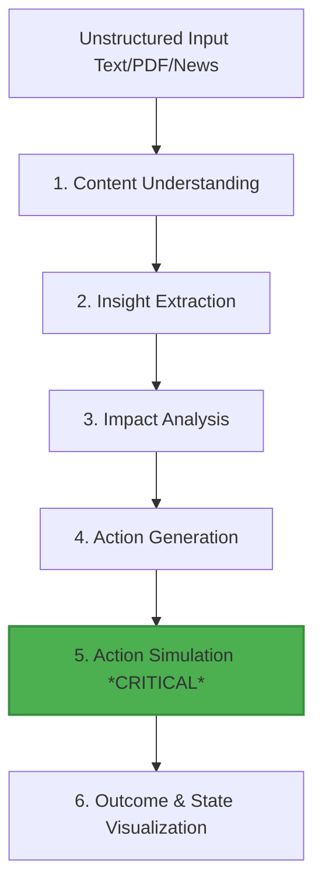

# 🚀 Google AI Seekho — Challenge 1
## Autonomous Content-to-Action Agent (Insight ➔ Action System)

---

### 📌 Challenge Overview
In today’s world, organizations are flooded with unstructured information—reports, news, dashboards, and policy updates. However, most AI systems stop at mere summarization or analysis. 

Real-world agentic systems must go further. They must:
* **Understand** unstructured information contextually.
* **Extract** actionable insights (moving beyond generic summaries).
* **Make Decisions** autonomously based on the analysis.
* **Take Action** by interacting with systems, APIs, or tools.

> [!IMPORTANT]
> **Core Objective:** Build an Agentic AI System that transforms unstructured content into actionable outcomes.

---

### ⚙️ Core Workflow Architecture

---

### 🛠️ Mandatory Technical Stack
> [!WARNING]
> **Google Antigravity Integration is Mandatory (25% of Total Grade)**
> Teams **MUST** use **Google Antigravity** as the core development platform to:
> * Orchestrate agent workflows and coordinate multi-agent routines.
> * Manage reasoning, planning, and tool selection.
> * Integrate external tools, microservices, and APIs.
> * Handle reliable execution of generated actions.
> 
> *Note: Use of additional LLMs is permitted, but Google Antigravity must remain central to the system logic.*

---

### 📋 Key System Requirements

1. **Content Understanding**
   * Process diverse unstructured inputs (text, PDFs, website links, news articles, etc.).
   * Extract key facts, variables, and relevant data signals.

2. **Insight Extraction**
   * Identify meaningful, non-trivial patterns or insights.
   * *Avoid simple or generic summarization.*

3. **Impact Analysis**
   * Explain *why* the extracted insight matters.
   * Directly connect the insight to real-world consequences and business/operational implications.

4. **Action Generation**
   * Generate clear, actionable, and domain-relevant recommendations.
   * Ensure that recommendations are realistic and practical.

5. **Action Simulation (CRITICAL REQUIREMENT)**
   * You **must** simulate the execution of at least one generated action.
   * **Simulation options include:**
     * Mock API calls (e.g., triggering a webhook)
     * Dashboard / Database updates
     * CRM or Spreadsheet updates (e.g., updating a Google Sheet)
     * Notification triggers (e.g., Slack alerts, Email/SMS generation)
     * General workflow triggers

6. **Outcome Visualization**
   * Show a clear **Before vs. After** state comparison.
   * Provide trace logs of the action execution.
   * Render the resulting system change or outcome.

7. **Agentic Workflow & Reasoning**
   * Demonstrate structured reasoning steps (e.g., ReAct, Plan-and-Solve) or a multi-agent system.
   * Ensure the planning and execution flow is fully traceable and transparent.

---

### 💡 Example Reference Scenarios

#### Scenario 1: Business Operations & Insight
* **Input:** A regional sales report showing declining orders.
* **Insight:** Regional orders in **Lahore** have declined by **25%**.
* **Impact:** Expected regional revenue loss.
* **Recommended Action:** Launch a targeted regional discount campaign.
* **Simulated Execution:** 
  1. Campaign created.
  2. Notifications/campaign codes generated.
* **Resulting Outcome:** Campaign live; projected reach: **5,000 users**.

#### Scenario 2: Policy, News & Logistics
* **Input:** A news article reporting a fuel price increase.
* **Insight:** Fuel prices are rising.
* **Impact:** Inevitable increase in delivery and logistics costs.
* **Recommended Action:** Update active delivery pricing tables.
* **Simulated Execution:**
  1. Delivery pricing table updated in the database.
  2. Customer fee notification drafted.
* **Resulting Outcome:** New delivery fee applied in checkout simulations.

---

### 📊 Evaluation Rubric (100 Points Total)

| Weight | Criteria | Key Evaluation Focus |
| :--- | :--- | :--- |
| **25%** | **Google Antigravity Usage** | Is Antigravity used in core orchestration? Does it handle reasoning and tool execution effectively? (Must not be superficial). |
| **20%** | **Agentic Reasoning & Workflow** | Clear multi-step reasoning. Clear logical flow: **Insight ➔ Action ➔ Execution**. Clear evidence of agent autonomy. |
| **20%** | **Insight & Decision Quality** | Are the insights meaningful and non-trivial? Is there strong, logical reasoning behind recommended actions? Outputs are structured and clear. |
| **15%** | **Action Simulation & Outcome** | Is the action realistically simulated? Is there a clear, visible change in system state? End-to-end execution visible. |
| **10%** | **Technical Implementation** | Clean architecture, proper tool/API integrations, robustness, and graceful handling of edge cases. |
| **10%** | **Innovation & UX** | Creative approach, intuitive UI/dashboard, and a compelling, clear demonstration video. |

---

### 📦 Submission Deliverables

* [ ] **1. Working Prototype**
  * **Mobile App:** Mandatory requirement (**MUST**).
  * **Web App:** Optional but highly encouraged.
* [ ] **2. Demo Video (3–5 minutes)**
  * Must clearly showcase: `Input ➔ Insight ➔ Action ➔ Simulation ➔ Result`.
* [ ] **3. Agent Trace / Logs from Antigravity**
  * Raw logs and execution traces showing:
    * Workplan and planning tasks.
    * Reasoning steps and decision flow.
    * Action execution and tool calls.
* [ ] **4. Documentation (README)**
  * System architecture overview.
  * Integration details (tools/APIs used).
  * Explicit explanation of how Google Antigravity is used.
  * Core assumptions made during development.

---

### ⚠️ Important Guidelines
* 🚫 **This is NOT a summarization tool.** Systems must demonstrate action-oriented intelligence.
* ⚙️ **Simulation is mandatory.** At least one action must execute in a simulated environment.
* 🌍 **Real-world focus.** Use of real-world inspired scenarios is highly encouraged.
* 🔒 **Data Privacy.** Absolutely **no** sensitive or real personal data should be used.