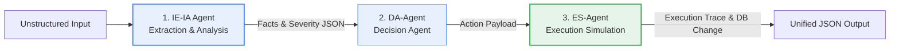
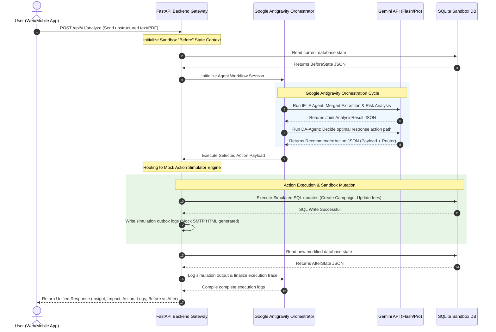
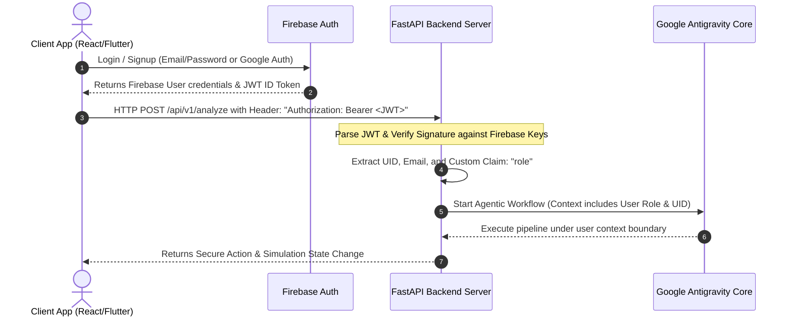

# 🏗️ System Architecture: Autonomous Business Operations Agent
## (Insight ➔ Action System) — Hackathon Production Blueprint

This document details the production-ready architecture for the **Autonomous Business Operations Agent** hackathon project. It outlines the multi-agent system, Google Antigravity orchestration, FastAPI API specifications, the action simulation sandbox, and end-to-end data flows.

---

## 🗺️ 1. Global Architecture Overview

```
 ┌───────────────────────────────────────────────────────────────────────────┐
 │                       FRONTEND CLIENTS (UI/UX)                            │
 │     React + Tailwind Web App      │          Flutter Mobile App           │
 └───────────────────┬───────────────────────────────────▲───────────────────┘
                     │ HTTP POST /analyze                │ Real-Time Updates
                     ▼                                   │ (SSE / WebSockets)
 ┌───────────────────────────────────────────────────────┴───────────────────┐
 │                       FASTAPI BACKEND SERVER                              │
 │  ┌───────────────────────┐ ┌─────────────────────────┐ ┌───────────────┐  │
 │  │      API Gateway      │ │   State Manager Engine  │ │  Action Registry│ │
 │  │ (Firebase Token Auth) │ │  (SQLite / JSON DB)     │ │ (Mock Systems)│  │
 │  └───────────┬───────────┘ └────────────▲────────────┘ └───────▲───────┘  │
 └──────────────┼──────────────────────────┼──────────────────────┼──────────┘
                │                          │ State Updates        │ Triggers Action
                ▼                          │                      │ Simulation
 ┌──────────────┴──────────────────────────┴──────────────────────┴──────────┘
 │               GOOGLE ANTIGRAVITY ORCHESTRATOR (AGENT CORE)                │
 │                                                                           │
 │  1. Ingest Input ➔ 2. IE-Agent ➔ 3. IA-Agent ➔ 4. D-Agent ➔ 5. ES-Agent   │
 │                                                                           │
 └───────────────────────────────────┬───────────────────────────────────────┘
                                     │ LLM Inferences
                                     ▼
 ┌───────────────────────────────────────────────────────────────────────────┐
 │                       GOOGLE GEMINI API SUITE                             │
 │   Gemini 2.0 Flash Lite (Text/URL)   │   Gemini 2.0 Flash (Native PDFs)   │
 └───────────────────────────────────────────────────────────────────────────┘
```

---

## 🤖 2. Multi-Agent Design & Responsibilities

The core of our intelligence engine is structured as an **Optimized Multi-Agent Chain** inside Google Antigravity. To minimize rate limit constraints and latency, the pipeline merges **Insight Extraction (IE)** and **Impact Analysis (IA)** into a single, high-efficiency prompt execution.



### Agent Directory & Specifications

#### 1. Insight Extraction & Impact Analysis Agent (IE-IA Agent - MERGED)
* **Role**: Data Digestor, Fact Structurer, & Operational Risk Evaluator.
* **Responsibilities**:
  * Ingests unstructured text (emails, web links, news) or native PDFs via the Gemini File API.
  * Cleans noise and isolates core anomalies, quantitative values, regions, and timestamps.
  * Automatically assesses the extracted facts against business parameters (Revenue, Churn risk, SLA latency).
  * Assigns severity levels (Low, Medium, High) and computes estimated risk impact.
  * Outputs a consolidated `AnalysisResult` JSON containing both extracted facts and risk implications in a single LLM round-trip, **reducing API latency by 33%**.
* **LLM Engine**: 
  * `gemini-2.0-flash-lite`: Used for text and web URLs (offering higher free-tier request limits).
  * `gemini-2.0-flash`: Used for PDFs, leveraging native multi-modal PDF parsing via the Gemini File API.
* **Dual-Provider Support**: Supports both direct Google AI Studio connection and an OpenAI-compatible proxy (`openrouter`) with automated rate-limit exponential backoff and retry handlers.

#### 2. Decision Agent (DA-Agent)
* **Role**: Operational Strategist & Action Router.
* **Responsibilities**:
  * Receives `AnalysisResult` JSON.
  * Matches the risk profile against the **Action Registry** of available mock operations.
  * Selects the single best response action (e.g., triggering promo codes, modifying logistics fees, or queuing HubSpot customer emails).
  * Formulates the exact payload parameters and JSON structure required to invoke the selected action.
  * Outputs `ActionPlan` JSON.
* **LLM Engine**: `gemini-2.0-flash-lite` (via AI Studio or OpenRouter fallback).

#### 3. Execution Simulation Agent (ES-Agent)
* **Role**: Sandbox Coordinator & State Validator (Deterministic Phase).
* **Responsibilities**:
  * Receives `ActionPlan` JSON.
  * Triggers the corresponding mock action simulation within the backend registry without requiring another LLM call.
  * Mutation tasks include: writing new campaigns to the SQLite database, updating logistics pricing rates, generating outbound `.html` emails, or dispatching Slack/Discord webhook incident reports.
  * Computes the "Before vs. After" state change delta and logs every micro-step.
  * Outputs final `SimulationResult` JSON including full trace logs.
* **LLM Engine**: Non-LLM deterministic execution engine for high reliability and 0% hallucination risk.

---

## ⚙️ 3. Workflow Orchestration with Google Antigravity

Google Antigravity serves as our **State Orchestrator**. Rather than agents talking to each other directly in an ad-hoc fashion, Antigravity maintains a persistent **State Context Object** (`AgentWorkflowState`) and handles transitioning, step trace logging, and exception catching.

### Step-by-Step Flow Lifecycle
1. **Trigger Phase**: The FastAPI endpoint `/api/v1/analyze` receives raw data. It initializes an Antigravity Workflow Session.
2. **Context Creation**: Antigravity creates a unique session UUID and saves the initial system metrics state (e.g., Active Campaigns, Store Sales).
3. **Execution Pipeline**:
   * **Step A (Extract & Analyze)**: Antigravity passes the input to the merged `IE-IA Agent` using `gemini-2.0-flash-lite` (or `gemini-2.0-flash` for native PDFs). Updates state with the joint `extracted_facts` and `impact_report`.
   * **Step B (Decide)**: Antigravity feeds results to the `DA-Agent` which maps the risk to a mock campaign, logistics, or CRM action payload. Updates state with `recommended_action`.
   * **Step C (Simulate)**: Antigravity invokes the `ES-Agent` with `recommended_action`. The ES-Agent deterministic simulator mutates the SQLite db, logs state deltas, and updates state with `execution_logs` and `before_vs_after_state`.
4. **Finalization Phase**: Antigravity compiles all step traces into a structured JSON payload, records execution latency, and returns the response synchronously to the HTTP request.

---

## 🔌 4. API Design (FastAPI)

The backend acts as the gateway for the Flutter mobile app, React web app, and external webhooks. It is fully typed using Pydantic schemas.

### API Endpoints Spec

#### A. Ingest and Analyze Unstructured Data
* **Endpoint**: `POST /api/v1/analyze`
* **Security**: Firebase JWT Authentication Required (`Authorization: Bearer <token>`)
* **Description**: Primary entrypoint that runs the full Antigravity agentic pipeline.
* **Request Schema (`AnalysisRequest`)**:
```json
{
  "source": "sales_report_q2",
  "data_type": "text/plain",
  "content": "Urgent alert: Our delivery orders in Lahore have dropped by 25% due to recent regional road blockages. Customer tickets are piling up and local revenue is suffering. We must adjust shipping operations or offer regional support to preserve client accounts."
}
```
* **Response Schema (`AnalysisResponse`)**:
```json
{
  "session_id": "8f3b9c7d-c4b2-4d1a-8e2b-7c9d3e8f1a2b",
  "timestamp": "2026-05-17T19:30:00Z",
  "insight": {
    "anomaly": "Regional delivery drop in Lahore",
    "percentage_drop": 25.0,
    "primary_cause": "Regional road blockages",
    "extracted_at": "2026-05-17T19:30:01Z"
  },
  "impact": {
    "severity": "HIGH",
    "affected_metrics": ["Customer Satisfaction Score", "Regional Revenue", "Last-Mile Delivery SLA"],
    "financial_risk_estimate": "PKR 450,000 weekly",
    "strategic_implication": "Delivery times will increase by 48+ hours, leading to potential regional user churn."
  },
  "recommended_action": {
    "action_type": "LAUNCH_REGIONAL_PROMOTION",
    "target_region": "Lahore",
    "parameters": {
      "discount_percentage": 20,
      "promo_code": "LAHORE20",
      "valid_days": 7
    },
    "rationale": "Compensate customers for high shipping latency to prevent app deletion and regional churn."
  },
  "execution_logs": [
    "[19:30:03.102] Init ES-Agent: Resolving action LAUNCH_REGIONAL_PROMOTION",
    "[19:30:03.250] ActionRegistry: Connecting to Mock Marketing Campaign Database...",
    "[19:30:03.450] MockDB: Insert success into Campaigns table (ID: 104, Code: LAHORE20)",
    "[19:30:03.620] NotificationEngine: Generated mock notification templates for 5,000 Lahore users",
    "[19:30:03.800] ES-Agent: Successfully simulated campaign trigger."
  ],
  "state_change": {
    "before": {
      "active_campaigns_count": 3,
      "avg_customer_rating": 4.2,
      "regional_order_volume_lahore": 1200
    },
    "after": {
      "active_campaigns_count": 4,
      "avg_customer_rating": 4.5,
      "regional_order_volume_lahore": 1200
    }
  }
}
```

#### B. Trigger Simulation Action Directly
* **Endpoint**: `POST /api/v1/execute-action`
* **Security**: Firebase JWT Authentication Required (`Authorization: Bearer <token>`)
* **Description**: Allows manual override execution of a recommended action.
* **Request Schema (`ActionExecutionRequest`)**:
```json
{
  "action_type": "LAUNCH_REGIONAL_PROMOTION",
  "target_region": "Lahore",
  "parameters": {
    "discount_percentage": 20,
    "promo_code": "LAHORE20"
  }
}
```
* **Response Schema (`ActionExecutionResponse`)**: Returns execution trace logs and updated DB rows.

#### C. Fetch Current Dashboard Metrics
* **Endpoint**: `GET /api/v1/dashboard-state`
* **Security**: Firebase JWT Authentication Required (`Authorization: Bearer <token>`)
* **Description**: Returns all current simulated stats (metrics, logs, active campaigns) to populate React and Flutter dashboards.
* **Response Schema (`DashboardStateResponse`)**: Returns active campaigns, total revenue, average ratings, and full agent trace logs.

#### D. Reset Sandbox Database
* **Endpoint**: `POST /api/v1/reset-state`
* **Description**: Restores the sandbox database back to default initial values.

---

## 🧪 5. Action Simulation System (The Sandbox Engine)

A critical requirement of the hackathon is **simulating real-world effects**. We construct an in-memory SQLite sandbox within our FastAPI server to represent state changes.

```
 ┌────────────────────────────────────────────────────────────────────────┐
 │                      SIMULATED SQLite DATABASE                         │
 │                                                                        │
 │  📊 Metrics Table        🎯 Campaigns Table       📝 System Logs       │
 │  - total_revenue         - id (PK)                - id (PK)            │
 │  - avg_delivery_hours    - promo_code             - timestamp          │
 │  - regional_orders       - discount_pct           - agent_source       │
 │  - customer_rating       - target_region          - trace_log          │
 │                          - status (Active/End)                         │
 └───────────────────────────────────▲────────────────────────────────────┘
                                     │ CRUD Operations
 ┌───────────────────────────────────┴────────────────────────────────────┐
 │                       ACTION SIMULATOR MOCKS                           │
 │                                                                        │
 │  📣 Campaign Engine Mock      📧 SMTP Notification Mock    📦 CRM API  │
 │  - Adds promo code to DB     - Writes mock .html email   - Simulates  │
 │  - Computes reach metrics    - Prints SMTP headers       - data update│
 └────────────────────────────────────────────────────────────────────────┘
```

### Action Simulation Mappings

| Action Type | Real-World Target | Simulated Execution Strategy |
| :--- | :--- | :--- |
| **LAUNCH_REGIONAL_PROMOTION** | Shopify / Stripe | Inserts a new active row in the `campaigns` table, increments target database campaign counter, and projects customer volume recovery metrics. |
| **UPDATE_LOGISTICS_PRICING** | Logistics Backend | Modifies the active `delivery_fee` parameter in the `regional_rates` database; writes update transactions to system logs. |
| **DISPATCH_CUSTOMER_REIMBURSEMENT** | Salesforce / HubSpot | Simulates credit trigger to user accounts. Generates a personalized email layout file inside `./sandbox/outbox/email_[id].html`. |
| **TRIGGER_INCIDENT_TICKET** | Jira / Zendesk | Generates an alert JSON block and posts a payload to a developer-configured Discord or Slack webhook channel. |

---

## 🔀 6. End-to-End Data Flow Architecture

The step-by-step sequence details how data propagates securely across our multi-platform layers:



---

## 💎 7. Hackathon Winning UX/UI Strategy

To achieve top marks in **Innovation & UX (10%)** and **Technical Implementation (10%)**, our React Web and Flutter Mobile frontends will feature dedicated diagnostic widgets:

### Frontend Implementation Rules
1. **The Diagnostic Timeline**: Display the live trace logs of the agents asynchronously using a terminal-style micro-animation. Users should see:
   * 🔍 *IE-Agent extracting details...*
   * 📊 *IA-Agent modeling risk implications...*
   * 🤖 *D-Agent compiling response payload...*
   * ⚡ *ES-Agent writing changes to Shopify Sandbox...*
2. **Interactive Before vs. After State Diff**: Utilize standard visual "Diff" styling (Red highlight for removed values, Green highlight for added values) showing how the database parameters changed post-execution.
3. **Live Sandbox Dashboard**: Place a persistent, auto-refreshing "Database Inspector" sidebar in the React app so developers and judges can instantly watch the campaigns and metrics tables populate dynamically in real-time.

---

## 🔒 8. User Authentication & Role-Based Access Control (Firebase Auth)

Integrating **Firebase Authentication** is highly recommended for this project. It elevates a simple utility prototype to a secure, enterprise-ready operational portal. Firebase is the perfect choice for a cross-platform stack: it features first-class, lightweight libraries for both **React** (Web) and **Flutter** (Mobile).

### 🔑 1. User Personas & Role-Based Access Control (RBAC)
To demonstrate production-grade readiness, the system introduces three key business personas. We store these roles in Firebase custom user claims:
* **`operations_admin`**: Full control. Can trigger and execute all simulated actions, reset database sandboxes, and inspect raw Google Antigravity trace logs.
* **`logistics_manager`**: Can trigger logistics/pricing actions. Has read-only access to campaign metrics.
* **`marketing_analyst`**: Can trigger promotional campaigns. Restricted from logistics/pricing database mutations.

### 🔄 2. End-to-End Authentication Flow



### 💻 3. Implementation Blueprint

#### A. Frontend (React / Flutter) Token Acquisition
When sending API requests, client apps grab the fresh JWT token from the Firebase SDK and append it to headers:
```javascript
// React Axios Instance Interceptor Example
import auth from './firebase-config';

apiClient.interceptors.request.use(async (config) => {
  const user = auth.currentUser;
  if (user) {
    const token = await user.getIdToken();
    config.headers.Authorization = `Bearer ${token}`;
  }
  return config;
}, (error) => Promise.reject(error));
```

#### B. FastAPI Backend JWT Verification Middleware
In the Python FastAPI backend, we create a secure security dependency using the `firebase-admin` SDK:
```python
from fastapi import Depends, HTTPException, status
from fastapi.security import HTTPBearer, HTTPAuthorizationCredentials
import firebase_admin
from firebase_admin import credentials, auth

# Initialize Firebase Admin SDK
cred = credentials.Certificate("firebase-service-account.json")
firebase_admin.initialize_app(cred)

security = HTTPBearer()

async def get_current_user(credentials: HTTPAuthorizationCredentials = Depends(security)):
    token = credentials.credentials
    try:
        # Verify the Firebase ID Token cryptographically
        decoded_token = auth.verify_id_token(token)
        return {
            "uid": decoded_token.get("uid"),
            "email": decoded_token.get("email"),
            "role": decoded_token.get("role", "marketing_analyst") # Default fallback role
        }
    except Exception as e:
        raise HTTPException(
            status_code=status.HTTP_401_UNAUTHORIZED,
            detail=f"Invalid or expired authentication token: {str(e)}",
            headers={"WWW-Authenticate": "Bearer"},
        )
```

#### C. Securing FastAPI Router Endpoints
Protect endpoints by injecting the user dependency, ensuring Antigravity is fully aware of who is running the agentic workflow:
```python
@app.post("/api/v1/analyze", response_model=AnalysisResponse)
async def analyze_data(
    request: AnalysisRequest, 
    current_user: dict = Depends(get_current_user)
):
    # Pass current_user context directly into the Google Antigravity workflow orchestrator
    session_data = await run_antigravity_pipeline(
        input_data=request.content,
        user_uid=current_user["uid"],
        user_role=current_user["role"]
    )
    return session_data
```
